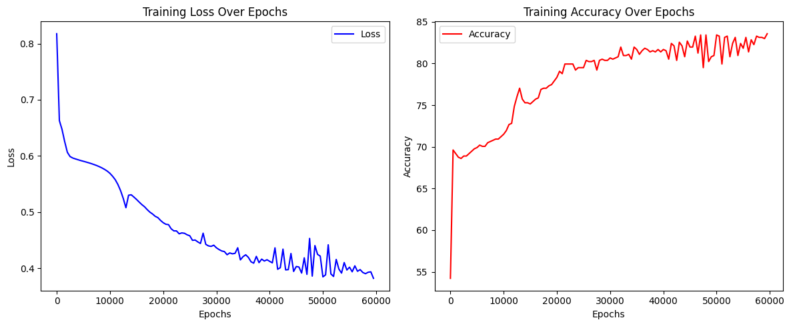
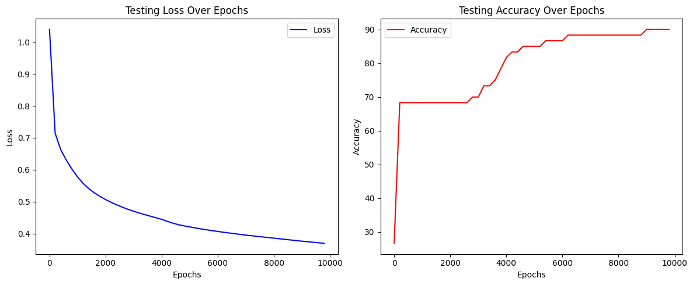

# 🫀 Heart Failure Predictor using PyTorch

---

## Overview  
This project implements a binary classification neural network to predict the likelihood of heart failure based on structured clinical data. Built using PyTorch, it includes preprocessing, model training, evaluation, and visualization.

---

## Dataset

1. [Kaggle] Heart Failure:  
<https://www.kaggle.com/datasets/fedesoriano/heart-failure-prediction>
2. [UC Irvine] Heart Failure:  
<https://archive.ics.uci.edu/dataset/519/heart+failure+clinical+records>

- [Plotting Sigmoid Function](./sigmoid-function.ipynb)
  
- [Binary Classify Heart Failure - 8 features - Kaggle Dataset](./classify-heart-failure.ipynb)⭐


- [Binary Classify Heart Failure - 3 features - Kaggle Dataset](./classify-heart-failure-2.ipynb)
  
- [Binary Classify Heart Failure - 7 features - UCI Dataset](./class-heart-failure-ds-2.ipynb) ⭐


---

## Table of Contents  
1. [Project Goals](#project-goals)  
2. [Model Architecture](#model-architecture)  
3. [Tech Stack](#tech-stack)  
4. [Installation & Setup](#installation--setup)  
5. [Usage](#usage)  
6. [Output & Evaluation](#output--evaluation)  
7. [Folder Structure](#folder-structure)  
8. [License](#license)

---

## Project Goals  
- Preprocess clinical heart data using label encoding and normalization.  
- Train a binary classifier using a PyTorch neural network.  
- Evaluate model accuracy, precision, recall, and F1 score.  
- Visualize training/testing performance with loss and accuracy curves.  
- Enable future deployment or API integration.

---

## Model Architecture  
- Input layer: 11 features  
- Hidden layers: Fully connected with ReLU activation  
- Output layer: Single neuron with Sigmoid activation  
- Loss Function: Binary Cross Entropy  
- Optimizer: Adam  

---

## Tech Stack  
- Python  
- PyTorch  
- Pandas  
- NumPy  
- Scikit-learn  
- Matplotlib  
- Seaborn  
- Jupyter Notebook

---

## Installation & Setup  

```bash
git clone https://github.com/your-username/heart-failure-predictor.git
cd heart-failure-predictor

# Create virtual environment
python -m venv venv
.\venv\Scripts\activate      # Windows
# OR
source venv/bin/activate     # macOS/Linux

# Install dependencies
pip install -r requirements.txt
```
---

## Usage

- Launch Jupyter Notebook:
```bash
jupyter notebook
```
- Open classify-heart-failure.ipynb
- Run the notebook cells top to bottom:
    - Import libraries & helper functions
    - Load & preprocess dataset
    - Train the model
    - Evaluate performance
    - Plot training/testing graphs

---

## Output & Evaluation

- 📉 Visualized training & test loss/accuracy
- 📊 Classification metrics:
    - Accuracy
    - Precision
    - Recall
    - F1 Score
    - Confusion Matrix

- 🧠 Model can predict:
    - 1 → High risk of heart failure
    - 0 → Low risk of heart failure

---

## Folder Structure

```bash
heart-failure-predictor/
├── classify-heart-failure.ipynb      # Main notebook
├── helper_functions.py               # Utility functions (train, test, plot)
├── heart.csv                         # Dataset (from Kaggle)
├── requirements.txt                  # Python dependencies
├── README.md                         # Project documentation
```

---

## License

This project is licensed under the MIT License.
See the LICENSE file for details.

